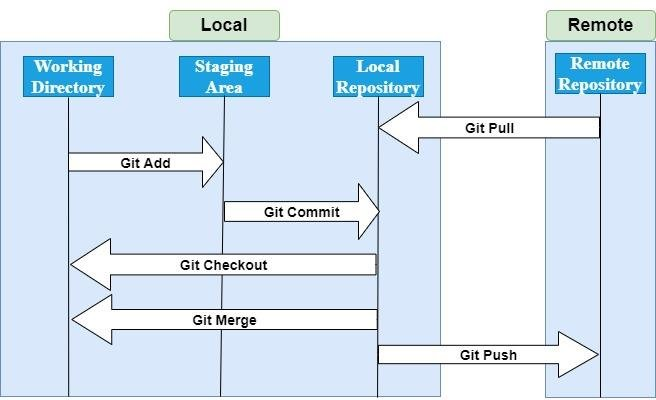

# Git

Git is a distributed version control system that tracks versions of files as they evolve within a project folder.

It enables an individual developer to track their changes over time, performing *undo* operations where necessary, create "branches" where new development can be performed in isolation from the main code-line. 

With an additional online repository it enables entire teams of developers to collaborate across a code-base, isolating individual's contributions from one another until it's safe to merge them all into a coherent and well maintained codebase.

In simple terms, if you've ever used Microsoft-Office's "*track changes*" functionality in a document, it's that, but with finer control, and across entire directories of files.

## Installation

[Installation instructions](https://git-scm.com/book/en/v2/Getting-Started-Installing-Git) differ depending on your target device, but most machine architectures are supported.

## Reference Links

[Main Reference Site](https://git-scm.com/docs)

## Usage

## Git Compatible Repositories

Whilst git can be used on its own to manage a local development, it really comes into its own when connected to a hosting platform/repository. This enables teams to collaborate on projects, pooling their activity and enabling distributed development.

### GitHub

### GitLab

### Bitbucket