# Matplotlib

Matplotlib is a data visualisation library for the python ecosystem. It allows complex visualisations to be described in code, which when executed generates visualisation images that can be used to explain data during a data analysis or exploration activity, or as figures as part of some documentation.

## Installation

Once any [python environment](python.md#python) is in place, matplotlib can be [installed](https://matplotlib.org/stable/users/installing/index.html) via `pip`

```
pip install matplotlib
```

If you're using [Jupyer Notebooks](jupyter.md#Jupyter) then it can be useful to include

```
%matplotlib inline
```

in your import/setup cells to auto-display visualisations in your notebooks.

## Gallery

Matplotlib provides a wide range of visualisation options, a selection of which are showcased below:

||||
| :----: | :----: | :----: |
|plot<br><a href="#plot">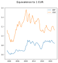</a>|scatter <br><a href="#scatter">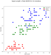</a>|bar<br><a href="#bar">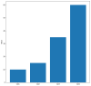</a>|
|histogram<br><a href="#histogram"></a>|boxplot<br><a href="#boxplot">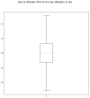</a>|violin<br><a href="#violin-plot">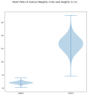</a>|
|image<br><a href="python.html"></a>|network<br><a href="python.html"></a>|bubble<br><a href="python.html"></a>|


### Plot

Line [plots](https://matplotlib.org/stable/api/_as_gen/matplotlib.axes.Axes.plot.html) are helpful when showing how a single variable develops over time. Multiple variables can be laid out on the same axes to compare behaviors at key points in time.

*Data Files*
```{eval-rst}
:download:`[eur_gbp.csv]<resources/eur_gbp.csv>` :download:`[eur_usd.csv]<resources/eur_usd.csv>`
```

```
import pandas as pd
import matplotlib.pyplot as plt
%matplotlib inline

gbp_data = pd.read_csv("eur_gbp.csv", skiprows=6, names=["Period", "Rate", "Status"], parse_dates=["Period"])
usd_data = pd.read_csv("eur_usd.csv", skiprows=6, names=["Period", "Rate", "Status"], parse_dates=["Period"])

fig = plt.figure(figsize=(6,6))
fig.suptitle("Equivalence to 1 EUR", fontsize=16)

x = gbp_data["Period"].values
y = gbp_data["Rate"].values
plt.plot(x,y, label="GBP")


x = usd_data["Period"].values
y = usd_data["Rate"].values
plt.plot(x,y, label="USD")

plt.ylim([0.5,1.6])
plt.legend()
```

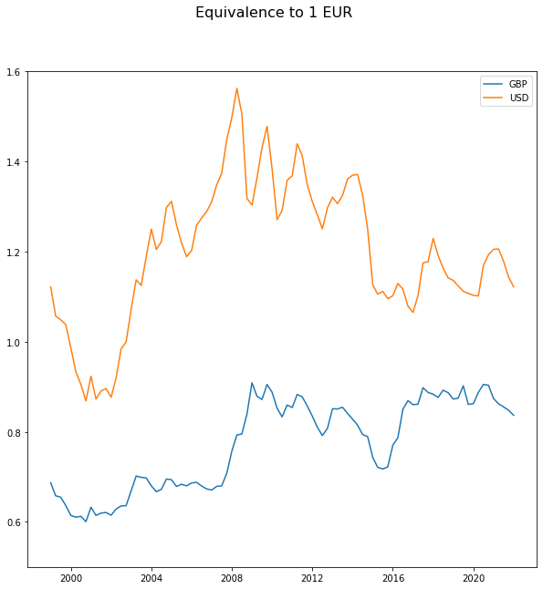


### Scatter

[Scatter plots](https://matplotlib.org/stable/api/_as_gen/matplotlib.axes.Axes.scatter.html) are useful for establishing links or relationships between a pair of variables - or for visualising clusters of similarly behaving objects into classes.

*Data Files*
```{eval-rst}
:download:`[iris.csv]<resources/iris.csv>`
```


```
import pandas as pd
import matplotlib.pyplot as plt
%matplotlib inline

iris_data =  pd.read_csv("iris.csv", index_col="variety")

fig = plt.figure(figsize=(10,10))
fig.suptitle("Sepal Length v Petal Width for Iris Varieties", fontsize=16)
varieties = set(iris_data.index)
cmap = {'Setosa' : "red", 'Versicolor' : "green", 'Virginica' : "blue"}
for v in varieties:
    x,y = zip(*iris_data.loc[v][['sepal.length', 'petal.width']].values)
    plt.scatter(x=x,y=y, marker="o", c=cmap[v], label=v, s=100)

plt.xlabel("Sepal Length")
plt.ylabel("Petal Width")

plt.legend()

```
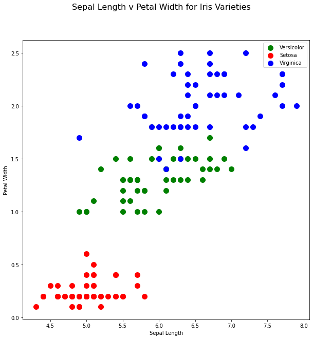

### Bar

[Bar charts](https://matplotlib.org/stable/api/_as_gen/matplotlib.axes.Axes.bar.html) are used when comparing a continuous data measure across different discrete categories. The input into this would normally be summary data.

An alternate specialised form is the [Histogram](matplotlib.md#histogram)

```
import pandas as pd
import matplotlib.pyplot as plt
%matplotlib inline

fig = plt.figure(figsize=(10,10))
data = { "Cat1" : 10,
         "Cat2" : 15,
         "Cat3" : 35,
         "Cat4" : 60}

plt.bar(data.keys(), data.values())
plt.ylabel("Value")

```
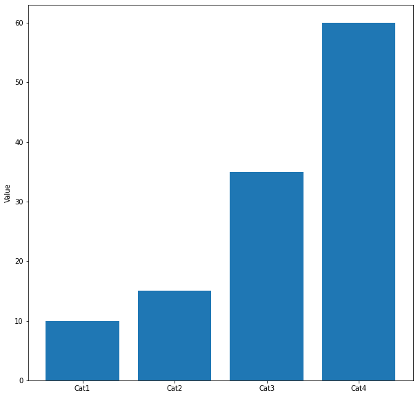


### Histogram

When the distribution of values across a variable is to be visualised, a [histogram](https://matplotlib.org/stable/api/_as_gen/matplotlib.axes.Axes.hist.html) is a useful visualisation.


*Data Files*
```{eval-rst}
:download:`[SOCR-HeightWeight.csv]<resources/SOCR-HeightWeight.csv>`
```

```
import pandas as pd
import matplotlib.pyplot as plt
%matplotlib inline

hw_data = pd.read_csv("SOCR-HeightWeight.csv", index_col="Index")
x,y = zip(*hw_data.values )

fig = plt.figure(figsize=(10,10))
fig.suptitle("Histogram of Human Weights in lbs", fontsize=16)
plt.hist(x, bins=31, alpha=0.95)
plt.ylabel("Frequency")
plt.xlabel("lbs")
```

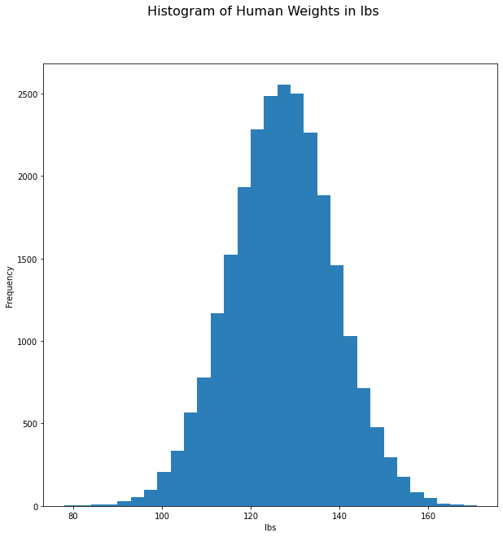


### Boxplot

An alternative to the histogram is the [boxplot](https://matplotlib.org/stable/api/_as_gen/matplotlib.axes.Axes.boxplot.html) (or box and whiskers plot). This draws a box around the central 50% percentile with whiskers extending to the 5^th, and 95^th percentile to give an indication of the range of the distribution. Additional outliers beyond the whiskers can be optionally included.

*Data Files*
```{eval-rst}
:download:`[SOCR-HeightWeight.csv]<resources/SOCR-HeightWeight.csv>`
```


```
import pandas as pd
import matplotlib.pyplot as plt
%matplotlib inline

hw_data = pd.read_csv("SOCR-HeightWeight.csv", index_col="Index")
x,y = zip(*hw_data.values )

fig = plt.figure(figsize=(10,10))
fig.suptitle("Box & Whisker Plot of Human Weights in lbs", fontsize=16)
# Set sym to non-empty string to add outliers
plt.boxplot(x, sym="")
```

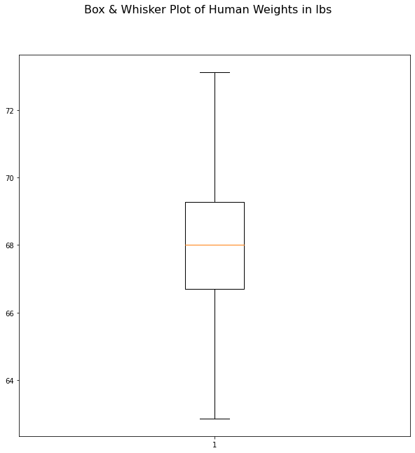

### Violin Plot

[Violin plots](https://matplotlib.org/stable/api/_as_gen/matplotlib.axes.Axes.violinplot.html) are smoothed histograms, focusing on the shapes of the distributions over their specific range-bin makeup.

*Data Files*
```{eval-rst}
:download:`[SOCR-HeightWeight.csv]<resources/SOCR-HeightWeight.csv>`
```

```
import pandas as pd
import matplotlib.pyplot as plt
%matplotlib inline

hw_data = pd.read_csv("SOCR-HeightWeight.csv", index_col="Index")
x,y = zip(*hw_data.values )

fig = plt.figure(figsize=(10,10))
fig.suptitle("Violin Plots of Human Weights in lbs and Heights in cm", fontsize=16)
plt.violinplot([x,y])
labels = ['Weights', 'Heights']
ax=plt.gca()
ax.set_xticks(range(1, len(labels) + 1))
ax.set_xticklabels(labels=labels)
```

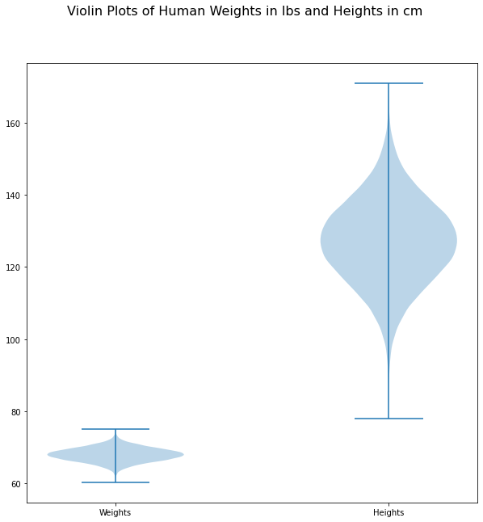
